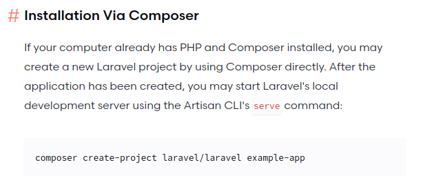

# Laravel & PHP Dockerized Project
### php install via composer
```console
$ docker-compose run --rm composer create-project --prefer-dist  laravel/laravel .
```


### 선택적 빌드
```console
$ docker-compose up -d server php mysql 
```
변화가 있는 경우 이미지를 다시 생성하고 실행한다.
```console
$ docker-compose up -d --build server
```

```console
$ docker-compose run --rm artisan migrate
```

### Docker compose with & withoud dockerfiles
`RUN, `CMD` 와 같은 명령어를 명시하거나 세부적이 내용은 dockerfile로 작성하고 `entrypoint` 와 같은 기본적인 사항은 docker-compose에서 설정할 수 있다.


